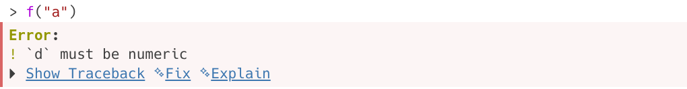
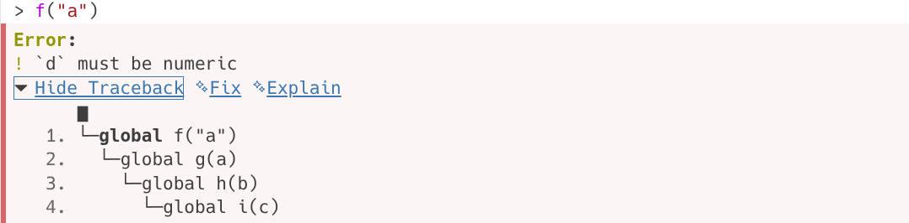

```{r}
#| label: setup
#| include: false
#| cache: false
source(here::here("setup.R"))
source(here::here("course_info.R"))
```

# Debugging strategy

## What's a bug?

An incorrect, unexpected, or unintended behaviour of code.

:::{.callout-tip}
## Why do we call it a bug?

Why not a mistake? A glitch? An oopsie-daisy?
:::

## What's a bug?

```{=typst}
#columns(2)[
  On September 9, 1947, a real moth was found causing a malfunction in the Harvard Mark II computer. This incident was recorded in the logbook with the note "First actual case of bug being found."

  #colbreak()

  #figure(image("harvard_mark_ii.jpg"))
]
```

## Overall debugging strategy

**Ask for help**

* Ask an LLM (OpenAI, Claude, ...)
* Ask a search engine (Google, Bing, DuckDuckGo, ...)
* Ask the community (Stack Overflow / Posit Community, ...)

**Fix it yourself**

* Update your software / R packages
* Create a minimal reproducible example
* Explore code to find where the error is
* Create a unit tests with expected behaviour
* Fix and test it

## Asking for help

To get useful help, it is important that you ask a **good question**. Consider answering these two equivalent questions, which is easier to understand and why?

## Asking for help

::: {.callout-important}
## urgent help needed with assignment error

My code doesn't work. Please help i need it working for my assignment asap!

data <- read.csv("C://Users/James/Downloads/project-a9j-2020a/files/survey_data.csv")
data %>% filter(y == "A") %>% ggplot(aes(y = y, x = temperature)) + geom_line()
:::

## Asking for help

::: {.callout-tip}
## Error with dplyr `filter()`: "object not found"

I'm trying to filter a dataset in `dplyr`, but I'm getting an error that I don't understand. Here's my code and error message:

```r
survey <- data.frame(x = c(1, 2, 3), y = c("A", "B", "C"))
survey %>% filter(y == "A")
```
Error: `Error in filter(y == "A") : object 'y' not found`

I expected it to return rows where `y` is `"A"`. How should I fix this?
:::

# Minimal reproducible examples

## Minimal reproducible examples

A minimal reproducible example (MRE) is essential for effectively communicating problems with code.

The process of creating a MRE might also help you resolve the problem yourself!

## Minimal reproducible examples

**Minimal**: Minimising code and data makes it easier to find the problem.

- Remove unnecessary code

- Prefer built-in datasets or small example datasets.

- Remove unused packages or files irrelevant to the problem.


## Minimal reproducible examples

**Reproducible**: Ensure that others can run your code and see the same problem.

- If external packages are needed, include loading the packages in your MRE.

- If you can't use built-in datasets, provide a minimal dataset with `data.frame()` or `dput()`.

- If your problem includes randomisation, include `set.seed()` with appropriate seed.


## Minimal reproducible examples

**Examples**: Provide a clear example of the problem.

- Explain what you expect versus what happens.

- Add code comments to highlight your intention and the problem.

## reprex

The **reprex** package helps create *minimal reproducible examples*.

* Results are saved to clipboard in form that can be pasted into a GitHub issue, Stack Overflow question, or email.
* `reprex::reprex()`: takes R code and outputs it in a markdown format.
* Append session info with `reprex(..., session_info = TRUE)`.

## Exercise: MRE

Create a Minimal Reproducible Example (MRE) for this code:

```r
library(tidyverse)
library(rainbow)

survey_data <- read.csv("https://arp.numbat.space/week5/survey_data.csv")

survey_data |>
  select(-RespondentID) |>
  group_by(Gender) |>
  count(Satisfaction)
```
<https://arp.numbat.space/week5/survey_dplyr_bug.R>


# Debugging tools

## The debugging workflow

1. Create a reprex that demonstrates the problem as a comment in the issue.
2. Fix the problem in the package code.
3. Add a comment to the issue explaining the bug and the fix, including a link to the commit containing the fix.
4. Add unit test(s) to the package that confirms the problem is fixed.
5. Close the issue.

## Debugging tools in R

* `traceback`: prints out function call stack after error occurs; does nothing if no error.
* `debug`: flags function for "debug" mode which allows you to step through execution of function one line at a time.
* `undebug`: removes the "debug" flag from a function.
* `browser`: pauses execution of a function and puts the function in debug mode.
* `trace`: insert code into a function at a specific line number.
* `untrace`: removes the code inserted by `trace`.
* `recover`: allows you to modify the error behaviour so that you can browse the function call stack after an error occurs.

## Traceback

```{r}
#| error: true
f <- function(a) g(a)
g <- function(b) h(b)
h <- function(c) i(c)
i <- function(d) {
  if (!is.numeric(d)) {
    stop("`d` must be numeric", call. = FALSE)
  }
  d + 10
}
```

{width=80%}

{width=80%}

## Exercise

:::{.callout-tip}
# Exercise: traceback
<https://arp.numbat.space/week5/01-traceback.R>
:::

## Interactive debugging

* Using `browser()`

  ```r
  i <- function(d) {
    browser()
    if (!is.numeric(d)) stop("`d` must be numeric", call. = FALSE)
    d + 10
  }
  ```

* Set breakpoints in Positron or RStudio by clicking to left of line number, or pressing `Shift+F9`.

* `options(error = browser)`


## Exercise

:::{.callout-tip}
# Exercise: browser
<https://arp.numbat.space/week5/02-browser.R>
:::

## Interactive debugging

Debugging commands:

1. **`n`**: Next line (step over).
2. **`s`**: Step into function.
3. **`c`**: Continue to next breakpoint.
4. **`f`**: Finish the current function.
5. **`Q`**: Quit debugging.
6. **`where`**: Show the call stack.
7. **`help`**: Help with these debugging commands.

## Interactive debugging

* `debug()` : inserts a `browser()` statement at start of function.
* `undebug()` : removes `browser()` statement.
* `debugonce()` : same as `debug()`, but removes `browser()` after first run.


## Exercise

:::{.callout-tip}
# Exercise: debug

<https://arp.numbat.space/week5/03-debug.R>

:::

## Common error messages

* could not find function `"xxxx"`
* object `xxxx` not found
* missing value where `TRUE` / `FALSE` needed
* attempt to apply non-function
* undefined columns selected
* subscript out of bounds
* object of type 'closure' is not subsettable
* `$` operator is invalid for atomic vectors
* list object cannot be coerced to type 'double'
* arguments imply differing number of rows
* non-numeric argument to binary operator


## Exercise

:::{.callout-tip}
# Exercise: errors

<https://arp.numbat.space/week5/04-errors.R>

:::

## Common warning messages

* NAs introduced by coercion
* replacement has `xx` rows to replace `yy` rows
* number of items to replace is not a multiple of replacement length
* the condition has length > 1 and only the first element will be used
* longer object length is not a multiple of shorter object length
* package is not available for R version `xx`

`#pause`{=typst}

Tip: turn warnings into errors with `options(warn = 2)` to use `traceback()`

## Exercises

:::{.callout-tip}
# Exercise: warnings

<https://arp.numbat.space/week5/05-warnings.R>

:::

`#pause`{=typst}

:::{.callout-tip}
# Exercise: debug

<https://arp.numbat.space/week5/06-debug.R>

:::

`#pause`{=typst}

:::{.callout-tip}
# Exercise: debug

<https://arp.numbat.space/week5/07-debug.R>

:::

## Non-interactive debugging

* Necessary for debugging code that runs in a non-interactive environment.
* Is the global environment different? Have you loaded different packages? Are objects left from previous sessions causing differences?
* Is the working directory different?
* Is the `PATH` environment variable, which determines where external commands (like `git`) are found, different?
* Is the `R_LIBS` environment variable, which determines where `library()` looks for packages, different?

## Non-interactive debugging

* `dump.frame()` saves state of R session to file.

  ```{r}
  #| eval: false
  dump_and_quit <- function() {
    # Save debugging info to file last.dump.rda
    dump.frames(to.file = TRUE)
    # Quit R with error status
    q(status = 1)
  }
  options(error = dump_and_quit)
  # In a later interactive session ----
  load("last.dump.rda")
  debugger()
  ```

* Last resort: `print()`: slow and primitive.

## Other tricks

* `sink()` : capture output to file.
* `rlang::with_abort()` : turn messages into errors.
* If R or RStudio crashes, it is probably a bug in compiled code.
* Post minimal reproducible example to Posit Community or Stack Overflow.

# Styling

## Style guides

**Tidyverse**

<https://style.tidyverse.org/>

**Google**

<https://google.github.io/styleguide/Rguide.html>

## Indentation

- Use **2 spaces** per indentation level.

- Add spaces around operators: `x <- y + z`.

## Naming (functions, arguments, objects)

Be brief but descriptive with object names.

Use a consistent naming convention:

- camelCase
- snake_case
- PascalCase

## Design

- **Modularity**: Create re-usable parts for maintainability and scalability.
- **Simplicity**: Keep the interface intuitive and easy to use with straightforward interactions.
- **Flexibility**: Allow adaptability to different use cases and user preferences.
- **Feedback**: Provide clear and timely feedback to inform users of actions, errors, and system states.

## Automatic styling

* styler: <https://styler.r-lib.org/>
* air: <https://posit-dev.github.io/air/>

These can be configured to automatically style your code when you save.

You can also check your code for common problems with:

* [lintr](https://lintr.r-lib.org/)
* [jarl](https://jarl.etiennebacher.com)
