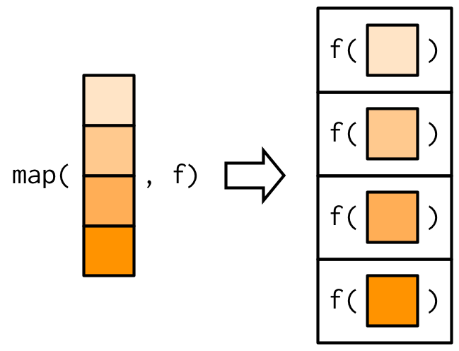
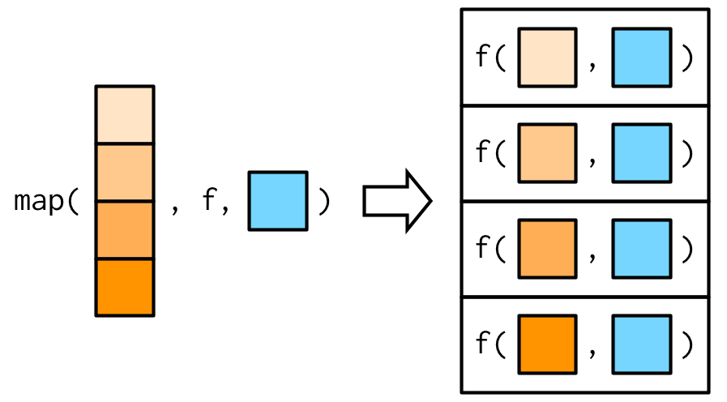
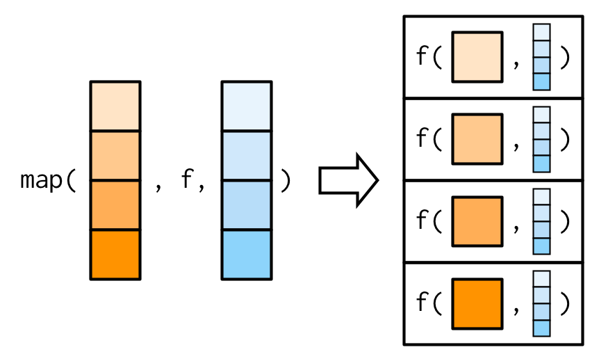
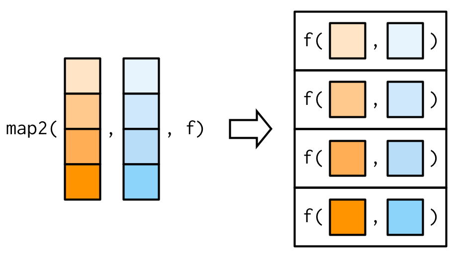
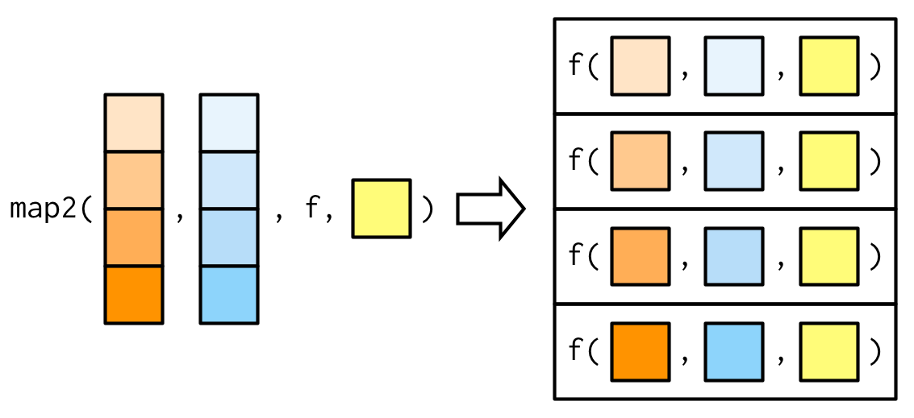
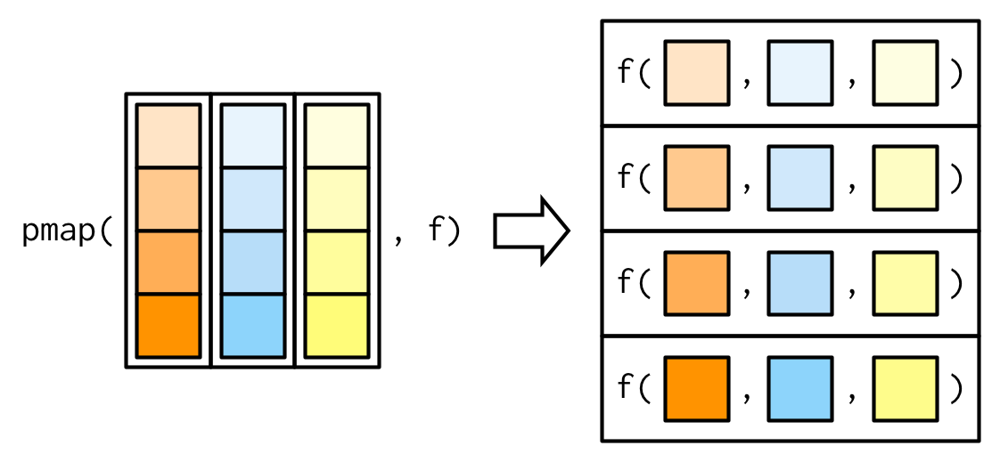
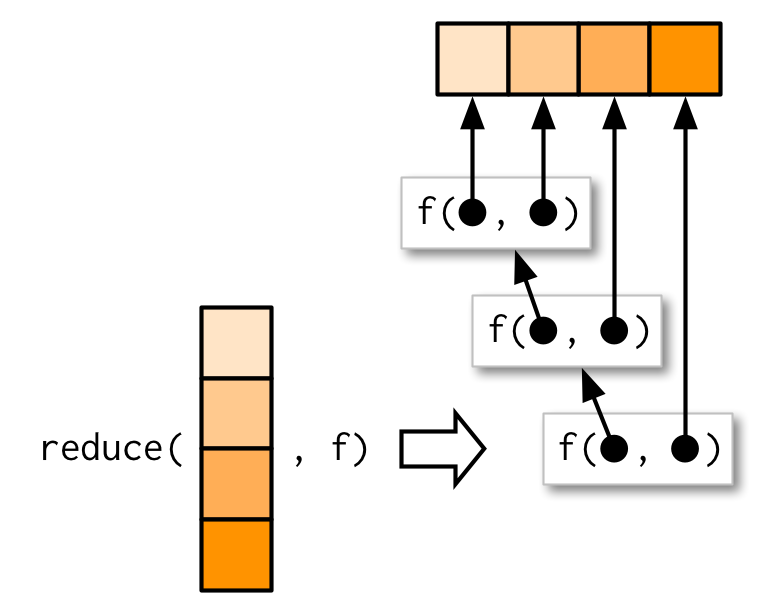

```{r}
#| label: setup
#| include: false
#| cache: false
source(here::here("setup.R"))
source(here::here("course_info.R"))
set.seed(2)
```


# Programming paradigms

## Programming paradigms

R code is typically structured using these paradigms:

* Literate programming
* Reactive programming
* Functional programming
* Object-oriented programming

Often several paradigms used together to solve a problem.

## Programming paradigms


::: {.callout-note icon=false}
# Literate programming
* Natural language is interspersed with code.
* Aimed at prioritising documentation/comments.
* Now used to create reproducible reports/documents.
* e.g., R Markdown, Quarto, Jupyter Notebooks, etc.
:::

`#pause`{=typst}

::: {.callout-note icon=false}
# Reactive programming
* Objects are expressed using code based on inputs.
* When inputs change, the object's value updates.
* e.g., Shiny
:::

## Programming paradigms

::: {.callout-note icon=false}
# Object-oriented programming (W8 - W9)
* Functions are associated with object types.
* Methods of the same 'function' produce object-specific output.
:::

`#pause`{=typst}

::: {.callout-note icon=false}
# Functional programming (W6; today!)
* Functions are created and used like any other object.
* Output should only depend on the function's inputs.
:::

# Functional programming

## Functional programming

R is commonly considered a 'functional' programming language - and so far we have used functional programming.

```{r}
square <- function(x) {
  return(x^2)
}
square(8)
```

The `square` function is an object like any other in R.

## Functions are objects

R functions can be printed

```{r}
print(square)
```

`#pause`{=typst}

R functions can be inspected

```{r}
formals(square)
```

## Functions are objects

R functions can be put in a list

```{r}
my_functions <- list(square, sum)
my_functions
```

## Functions are objects

R functions can be used within lists,

```{r}
my_functions[[1]](8)
```

`#pause`{=typst}

but they can't be subsetted!

```{r}
#| error: true
square$x
```

## Handling input types

Functional programming handles different input types using control flow. The same code is ran regardless of object type.

```{r}
square <- function(x) {
  if(!is.numeric(x)) {
    stop("`x` needs to be numeric")
  }
  return(x^2)
}
```

`#pause#v(-.2em)`{=typst}

::: {.callout-tip}
## In weeks 8--9 ...

We will see object-oriented programming, which handles different input types using different functions (methods)!
:::

## What are functions?

A function is comprised of three components:

* The arguments/inputs (`formals()`)
* The body/code (`body()`)
* The environment (`environment()`)

`#pause`{=typst}

::: {.callout-caution}
# Your turn!
Use these functions to take a closer look at `square()`.

Try modifying the function's formals/body/env with `<-`.
:::

## Functional programming

Since functions are like any other object, they can also be:

* **inputs** to functions

::: {.callout-tip}
# Extensible design with function inputs
Using function inputs can improve your package's design!

Rather than limiting users to a few specific methods, allow them to use and write any method with functions.
:::


## Function arguments

Consider a function which calculates accuracy measures:

```{r}
accuracy <- function(e, measure, ...) {
  if (measure == "mae") {
    mean(abs(e), ...)
  } else if (measure == "rmse") {
    sqrt(mean(e^2, ...))
  } else {
    stop("Unknown accuracy measure")
  }
}
```

::: {.callout-tip}
# Improving the design`#v(-.75em)`{=typst}
This function is limited to only computing MAE and RMSE.
:::

## Function arguments

Using function operators allows any measure to be used.

```{r}
#| eval: false
MAE <- function(e, ...) mean(abs(e), ...)
RMSE <- function(e, ...) sqrt(mean(e^2, ...))
accuracy <- function(e, measure, ...) {
  ???
}
accuracy(rnorm(100), measure = RMSE)
```

::: {.callout-caution}
# Your turn!
Complete the accuracy function to calculate accuracy statistics based on the function passed in to `measure`.
:::

# Function factories

## Functional programming

Since functions are like any other object, they can also be:

* **inputs** to functions

* **outputs** of functions

::: {.callout-tip}
# Functions making functions?
These functions are known as *function factories*.

Where have you seen a function that creates a function?
:::

## Function factories

Let's generalise `square()` to raise numbers to any power.

```{r}
power <- function(x, exp) {
  x^exp
}
power(8, exp = 2)
power(8, exp = 3)
```

## Function factories

```{r}
power_factory <- function(exp) {
  function(x) {
    x^exp
  }
}
square <- power_factory(exp = 2)
square(8)
```

```{r}
cube <- power_factory(exp = 3)
cube(8)
```

## Function factories

Consider this function to calculate plot breakpoints of vectors.

```{r}
breakpoints <- function(x, n.breaks) {
  seq(min(x), max(x), length.out = n.breaks)
}
```

::: {.callout-caution}
# Your turn!
Convert this function into a function factory.

Is it better to create functions via `x` or `n.breaks`?
:::

# Functional mapping

## Split, apply, combine

Many problems can be simplified/solved using this process:

* split (break the problem into smaller parts)
* apply (solve the smaller problems)
* combine (join solved parts to solve original problem)

`#pause`{=typst}

This technique applies to both

* writing functions (rewriting a function into sub-functions)
* working with data (same function across groups or files)

## data |> group_by() |> summarise()

An example of split-apply-combine being used to work with data is when `group_by()` and `summarise()` are used together.

`#pause`{=typst}

* split: `group_by()` splits up the data into groups
* apply: your `summarise()` code calculates a single value
* combine: `summarise()` combines the results into a vector


## data |> group_by() |> summarise()

```{r}
library(dplyr)
mtcars |>
  group_by(cyl) |>
  summarise(mean(mpg))
```

## Split-apply-combine for vectors and lists

The same idea can be used for calculations on vectors.

`#pause`{=typst}

There are two main implementations we consider:

* base R: The `*apply()` functions
* purrr: The `map*()` functions

`#pause`{=typst}

We will use purrr, but I'll also share the base R equivalent.

## for or map?

Let's `square()` a vector of numbers with a for loop.

```{r}
x <- c(1, 3, 8)
x2 <- numeric(length(x))
for (i in seq_along(x)) {
  x2[i] <- square(x[i])
}
x2
```

`#pause`{=typst}

> *Of course `square()` is vectorised, so we should use `square(x)`. Other functions like `lm()` and `read.csv()` are not!*

## for or map?

Instead using `map()` we get...

```{r}
library(purrr)
x <- c(1, 3, 8)
map(x, square) # lapply(x, square)
```

## Mapping vectors

The same result, but it has been combined differently!

{fig-align="center"}

## Mapping vectors

To combine the results into a vector rather than a list, we instead use `map_vec()` to combine results into a vector.

```{r}
library(purrr)
x <- c(1, 3, 8)
map_vec(x, square) # vapply(x, square, numeric(1L))
```

## for or map?

::: {.callout-tip}
# Advantages of map
* Less coding (less bugs!)
* Easier to read and understand.
* Easy to parallelise
:::

`#pause`{=typst}

::: {.callout-important}
# Disadvantages of map
* Less control over loop
* Cannot solve sequential problems
:::

## Functional mapping

Recall `group_by()` and `summarise()` from dplyr:

```{r}
#| eval: false
mtcars |>
  group_by(cyl) |>
  summarise(mean(mpg))
```

::: {.callout-caution}
# Your turn!
Use `split()` and `map_vec()` to achieve a similar result.

*Hint: `split(mtcars$mpg, mtcars$cyl)` creates a list that splits `mtcars$mpg` by each value of `mtcars$cyl`.*
:::

## Anonymous mapper functions

<!-- Often the function that you map is more complicated than `mean`, and you might need to specify where the mapped vector is used. -->

Suppose we want to separately model `mpg` for each `cyl`.

```{r}
#| eval: false
lm(mpg ~ disp + hp + drat + wt, mtcars[mtcars$cyl == 4,])
lm(mpg ~ disp + hp + drat + wt, mtcars[mtcars$cyl == 6,])
lm(mpg ~ disp + hp + drat + wt, mtcars[mtcars$cyl == 8,])
```

## Anonymous mapper functions

We can split the data by `cyl` with `split()`,

```{r}
mtcars_cyl <- split(mtcars, mtcars$cyl)
```

but `map(mtcars_cyl, lm, mpg ~ disp + hp + drat + wt)` won't work - why?

`#pause`{=typst}

::: {.callout-important}
# Difficult to map
Using `map(mtcars_cyl, lm)` will apply `lm(mtcars_cyl[i])`.

The mapped vector is always used as the first argument!
:::

## Anonymous mapper functions

We can write our own functions!

```{r}
mtcars_lm <- function(.) lm(mpg ~ disp + hp + drat + wt, data = .)
map(mtcars_cyl, mtcars_lm)
```

## Anonymous mapper functions

Or use `~ body` to create anonymous functions.

```{r}
# lapply(mtcars_cyl, \(.) lm(mpg ~ disp + hp + drat + wt, data = .))
map(mtcars_cyl, ~ lm(mpg ~ disp + hp + drat + wt, data = .))
```

## Mapping mapping mapping

How would you then get the coefficients from all 3 models?

```{r}
#| eval: false
# mtcars_cyl |> lapply(\(.) lm(mpg ~ disp + hp + drat + wt, data = .))
mtcars_cyl |>
  map(~ lm(mpg ~ disp + hp + drat + wt, data = .))
```

## Mapping mapping mapping

```{r}
#| eval: true
# lapply(mtcars_cyl, \(.) lm(mpg ~ disp + hp + drat + wt, data = .) |> coef())
mtcars_cyl |>
  map(~ lm(mpg ~ disp + hp + drat + wt, data = .)) |>
  map(coef)
```


## Mapping arguments

Any arguments after your function are passed to all functions.

{fig-align="center"}

## Mapping arguments

This works by passing through `...` to the function.

```{r}
x <- list(1:5, c(1:10, NA))
map_dbl(x, ~ mean(.x, na.rm = TRUE))
map_dbl(x, mean, na.rm = TRUE)
```

## Mapping arguments

These additional arguments are not decomposed / mapped.

{fig-align="center"}

## Mapping multiple arguments

It is often useful to map multiple arguments.

{fig-align="center"}

## Mapping multiple arguments

```{r}
xs <- map(1:8, ~ ifelse(runif(10) > 0.8, NA, runif(10)))
map_vec(xs, mean, na.rm = TRUE)
```

`#pause`{=typst}

```{r}
ws <- map(1:8, ~ rpois(10, 5) + 1)
map2_vec(xs, ws, weighted.mean, na.rm = TRUE)
```


## Mapping multiple arguments

{fig-align="center"}

## Mapping many arguments

It is also possible to map any number of inputs with `pmap`.

```{r}
n <- 1:3
min <- c(0, 10, 100)
max <- c(1, 100, 1000)
pmap(list(n, min, max), runif) # .mapply(runif, list(n, min, max), list())
```

## Mapping many arguments

{fig-align="center"}

## Parallel mapping

Split-apply-combine problems are *embarrassingly parallel*.

`#pause`{=typst}

The furrr package (future + purrr) makes it easy to use `map()` in parallel, providing `future_map()` variants.

```{r}
library(furrr)
plan(multisession, workers = 4)
future_map_dbl(xs, mean, na.rm = TRUE)
future_map2_dbl(xs, ws, weighted.mean, na.rm = TRUE)
```

## Reduce vectors to single values

Sometimes you want to collapse a vector, reducing it to a single value. `reduce()` always returns a vector of length 1.

```{r}
x <- sample(1:100, 10)
x
sum(x)
# Alternative to sum()
reduce(x, `+`) # Reduce(`+`, x)
```

## Reduce vectors to single values

The result from the function is re-used as the first argument.

{fig-align="center"}

## Reduce vectors to single values

::: {.callout-caution}
# Your turn!
We're studying the letters in 3 bowls of alphabet soup.

Use `reduce()` to find the letters that were in all bowls of soup!

Are all letters found in the soups?
:::


## Reduce vectors to single values

```{r}
alphabet_soup <- map(c(10,24,13), sample, x=letters, replace=TRUE)
alphabet_soup
```

# Functional adverbs

## Functional adverbs

purrr also offers many *adverbs*, which modify a function.

::: {.callout-note icon=false}
# Capturing conditions
* `possibly(.f, otherwise)`: If the function errors, it will return `otherwise` instead.
* `safely(.f)`: The function now returns a list with 'result' and 'error', preventing errors.
* `quietly(.f)`: Any conditions (messages, warnings, printed output) are now captured into a list.
:::

## Functional adverbs

purrr also offers many *adverbs*, which modify a function.

::: {.callout-note icon=false}
# Changing results
* `negate(.f)` will return `!result`.
:::

::: {.callout-note icon=false}
# Chaining functions
* `compose(...)` will chain functions together like a chain of piped functions.
:::
