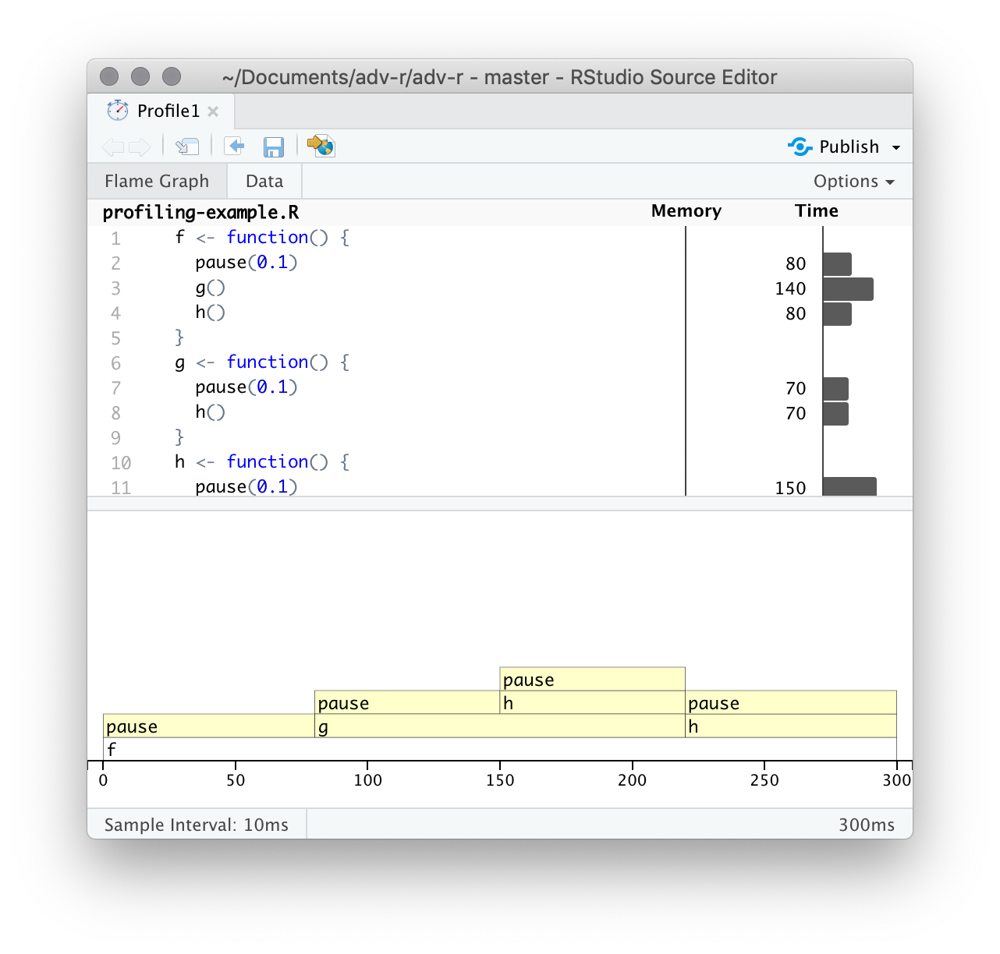

```{r}
#| label: setup
#| include: false
#| cache: false
source(here::here("setup.R"))
source(here::here("course_info.R"))
```

# Profiling

## Profiling functions

* `Rprof()` : records every function call.
* `summaryRprof()` : summarises the results.
* `profvis()` : visualises the results.

## Profiling

Where are the bottlenecks in your code?

```{r}
f <- function() {
  mean(rnorm(1e7))
  g()
  h()
}
g <- function() {
  mean(rnorm(1e7))
  h()
}
h <- function() {
  mean(rnorm(1e7))
}
```

## Profiling

```{r}
#| eval: false
tmp <- tempfile()
Rprof(tmp, interval = 0.1)
f()
Rprof(NULL)
```

```
sample.interval=100000
"rnorm" "mean" "f"
"rnorm" "mean" "f"
"rnorm" "mean" "f"
"rnorm" "mean" "g" "f"
"rnorm" "mean" "g" "f"
"rnorm" "mean" "h" "g" "f"
"rnorm" "mean" "h" "g" "f"
"rnorm" "mean" "h" "f"
"mean.default" "mean" "h" "f"
```

## Profiling

```{r}
#| eval: false
summaryRprof(tmp)
```

```
$by.self
               self.time self.pct total.time total.pct
"rnorm"              0.8    88.89        0.8     88.89
"mean.default"       0.1    11.11        0.1     11.11

$by.total
               total.time total.pct self.time self.pct
"f"                   0.9    100.00       0.0     0.00
"mean"                0.9    100.00       0.0     0.00
"rnorm"               0.8     88.89       0.8    88.89
"g"                   0.4     44.44       0.0     0.00
"h"                   0.4     44.44       0.0     0.00
"mean.default"        0.1     11.11       0.1    11.11

$sample.interval
[1] 0.1

$sampling.time
[1] 0.9
```

## Profiling

```{r}
#| eval: false
profvis::profvis(f())
```

{width=45% fig-align="center"}

## Profiling

* Garbage collection: if it takes a long time, you're creating many short-lived objects.
* Can't see inside C/C++ code
* Anonymous functions make it harder to identify bottlenecks.
* Lazy evaluation means arguments are sometimes evaluated in a different function than where they are called.

# Benchmarking

## Microbenchmarking

### `system.time()`

```{r}
x <- rnorm(1e6)
system.time(min(x))
system.time(sort(x)[1])
system.time(x[order(x)[1]])
```

## Microbenchmarking

### `bench::mark()`

```{r}
bench::mark(
  min(x),
  sort(x)[1],
  x[order(x)[1]]
)
```

## Microbenchmarking

* `mem_alloc` tells you the memory allocated in the first run.
* `n_gc` tells you the total number of garbage collections over all runs.
* `n_itr` tells you how many times the expression was evaluated.
* Pay attention to the units!

## Exercises

2.  What's the fastest way to compute a square root? Compare:

    - `sqrt(x)`
    - `x^0.5`
    - `exp(log(x) / 2)`

    Use `system.time()` find the time for each operation.

    Repeat using `bench::mark()`. Why are they different?

# Vectorisation

## Vectorisation

* Vectorisation is the process of converting a repeated operation into a vector operation.
* The loops in a vectorised function are implemented in C instead of R.
* Using `map()` or `apply()` is **not** vectorisation.
* Matrix operations are vectorised, and usually very fast.

## Exercise

Write the following algorithm to estimate $\displaystyle\int_0^1 x^2 dx$ using vectorised code

### Monte Carlo Integration
   a. Initialise: `hits = 0`
   b. for i in 1:N
      * Generate two random numbers,  $U_1, U_2$, between 0 and 1
      * If $U_2 < U_1^2$, then `hits = hits + 1`
   c. end for
   d. Area estimate = hits/N

## Exercise

Compare the speed of `apply(x, 1, sum)` and `rowSums(x)` for a large matrix `x`.

# Efficient coding

## Other efficiency improvements

* Never calculate something more than once.
* Avoid growing objects in a loop. Allocate space first.
* Do as little as possible.
* Move code out of loops if possible.
* Parallelise if you can't vectorise.
* Use `data.table()` instead of `data.frame()` for large datasets.
* Use `matrix()` instead of `data.frame()` or `data.table()` if all data are the same type.
* Find a built in function that does what you want instead of writing your own.

## Never calculate something more than once

```{r}
x <- rnorm(1e4)
bench::mark(
  bad = c(mean = mean(x), var = var(x), sd = sqrt(var(x))),
  good = {
    v <- var(x)
    c(mean = mean(x), var = v, sd = sqrt(v))
  }
)
```

## Avoid growing objects in a loop

```{r}
n <- 1e4
bench::mark(
  growing = {
    result <- c()
    for (i in seq_len(n)) result <- c(result, i^2)
  },
  preallocated = {
    result <- numeric(n)
    for (i in seq_len(n)) result[i] <- i^2
  }
)
```

## Do as little as possible

```{r}
x <- rnorm(1e6)
bench::mark(
  slow = which(x == min(x))[1],
  fast = which.min(x)
)
```

## Move code out of loops

```{r}
n <- 1e4
x <- rnorm(n)
bench::mark(
  inside = {
    result <- numeric(n)
    for (i in seq_len(n)) result[i] <- x[i] * mean(x)
  },
  outside = {
    mx <- mean(x)
    result <- numeric(n)
    for (i in seq_len(n)) result[i] <- x[i] * mx
  }
)
```

## Parallelise if you can't vectorise

```{r}
#| eval: false
# Sequential
purrr::map(1:8, slow_fn)

# Parallel
future::plan(multisession, workers = 4)
furrr::future_map(1:8, slow_fn)
```

## Use `data.table` for large datasets

```{r}
library(data.table)
library(dplyr)
n <- 1e6
df <- data.frame(g = sample(letters, n, replace = TRUE), x = rnorm(n))
dt <- as.data.table(df)
bench::mark(
  data.frame = summarise(df, mean(x), .by = g),
  data.table = dt[, .(mean = mean(x)), by = g],
  check = FALSE
)
```

## Use `matrix` for homogeneous data

```{r}
n <- 500
df <- as.data.frame(matrix(rnorm(n^2), nrow = n))
mat <- as.matrix(df)
bench::mark(
  data.frame = t(df) %*% as.matrix(df),
  matrix = t(mat) %*% mat
)
```

# Caching

## Caching: using rds

```{r}
#| eval: false
if (file.exists("results.rds")) {
  res <- readRDS("results.rds")
} else {
  res <- compute_it() # a time-consuming function
  saveRDS(res, "results.rds")
}
```

\pause\vspace*{1cm}

\alert{Equivalently\dots}

```{r}
#| eval: false
res <- xfun::cache_rds(
  compute_it(), # a time-consuming function
  file = "results.rds"
)
```

## Caching: using rds
\fontsize{10}{10}\sf

```{r}
#| label: cache1
#| cache: false
#| freeze: false
compute <- function(...) {
  xfun::cache_rds(rnorm(6), file = "results.rds", ...)
}
compute()
compute()
```

```{r}
#| include: false
#| cache: false
# Need to explicitly remove results.rds for some reason when doing this in quarto
file.remove(here::here("cache/results.rds"))
```

```{r}
#| label: cache2
#| cache: false
#| freeze: false
compute(rerun = TRUE)
compute()
```

## Caching downloads

Prevent downloads of the same data multiple times.

```{r}
#| eval: false
download_data <- function(url) {
  dest_folder <- tempdir()
  sanitized_url <- stringr::str_replace_all(url, "/", "_")
  dest_file <- file.path(dest_folder, paste0(sanitized_url, ".rds"))
  if (file.exists(dest_file)) {
    data <- readRDS(dest_file)
  } else {
    data <- readr::read_tsv(url, show_col_types = FALSE)
    saveRDS(data, dest_file)
  }
  data
}
bulldozers <- download_data(
  "https://robjhyndman.com/data/Bulldozers.csv"
)
```

## Caching: memoise

Caching stores results of computations so they can be reused.

\fontsize{10}{10}\sf

```{r}
library(memoise)
sq <- function(x) {
  cat("Computing square of 'x'")
  x^2
}
memo_sq <- memoise(sq)
memo_sq(2)
memo_sq(2)
```

## Exercises

Use `bench::mark()` to compare the speed of `sq()` and `memo_sq()`.

## Caching: Quarto

````{verbatim}
```{r}
#| label: import-data
#| cache: true
d <- read.csv('my-precious.csv')
```

```{r}
#| label: analysis
#| dependson: import-data
#| cache: true
summary(d)
```
````

## Caching: Quarto

* Requires explicit dependencies or changes not detected.
* Changes to functions or packages not detected.
* Good practice to frequently clear cache to avoid problems.
* targets is a better solution
