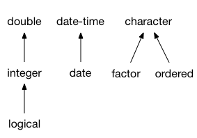

```{r}
#| label: setup
#| include: false
#| cache: false
source(here::here("setup.R"))
source(here::here("course_info.R"))
```

# S3 Recap

## Comparing S3 and vctrs

::: {.callout-note icon=false title="S3"}
* The OO system used by most of CRAN.
* Very simple (and 'limited') compared to other systems.
:::

`#pause`{=typst}

::: {.callout-note icon=false title="vctrs"}
* Builds upon S3 to make creating vectors easier.
* Good practices inherited by default.
:::

## S3 Recap: Objects and methods

* Unlike most OO systems where methods belong to **objects/data**, S3 methods *belong* to 'generic' **functions**.
* Recall that functions in R are objects like any other.
* To use S3, we call the generic function (e.g. `plot()`).
* This function looks at the inputs and dispatches (uses) the appropriate method for the input variable class/type.
* If there isn't a registered method for the object, the default method for the generic will be used.

## S3 Recap: S3 methods

An S3 method is an ordinary function with some constraints:

* The function's name is of the form `<generic>.<class>`,
* The function's arguments match the generic's arguments,
* The function is registered as an S3 method (for packages).

This looks like:

```r
#' Documentation for the method
#' @method <generic> <class>
<generic>.<class> <- function(<generic args>, <method args>, ...) {
  # The code for the method
}
```

## S3 Recap: S3 objects

To create an S3 object, we add a class to an object. e.g.,

```{r}
e <- structure(list(numerator = 2721, denominator = 1001), class = "fraction")
e
```

## S3 Recap: Constructor functions

These functions return classed S3 objects. They should handle input validation and be user-friendly.

Constructor functions typically come in two forms:

- complex: `tibble`, `lm`, `acf`, `svydesign`
- pure: `new_factor`, `new_difftime`

Pure constructor functions simply validate inputs and produce the classed object, while complex constructor functions involve calculations.

## S3 Recap: Constructor functions
`#set text(size: 18pt); #set par(leading: 0.55em)`{=typst}

```{r}
fraction <- function(numerator, denominator) {
  # Validate inputs
  stopifnot(is.numeric(numerator))
  stopifnot(is.numeric(denominator))
  if (any(denominator == 0)) {
    stop("I won't let you divide by 0.")
  }

  # Create the data structure (list)
  x <- list(numerator = numerator, denominator = denominator)

  # Return a classed S3 object
  structure(x, class = "fraction")
}
```
`#set text(size: 22pt); #set par(leading: 0.65em)`{=typst}

# vctrs

## Creating your own S3 vectors (with vctrs)

The *vctrs* package is helpful for creating custom vectors.

It is built upon S3, so the same approach for creating S3 generics and S3 methods also applies to vctrs.

::: {.callout-tip title="S3 or vctrs?"}
* Regular S3 is useful for creating singular objects
* vctrs is useful for creating vectorised objects
:::

## Creating your own S3 vectors (with vctrs)

::: {.callout-tip title="Why vctrs?"}
*vctrs* simplifies the complicated parts in creating vectors

* easy subsetting
* nice printing
* predictable recycling
* casting / coercion
* tidyverse compatibility
:::

## Some packages from Monash that use vctrs

* [distributional](https://github.com/mitchelloharawild/distributional/)

  Probability distributions in vectors
* [mixtime](https://github.com/mitchelloharawild/mixtime)

  Time points/intervals of various granularities in vectors
* [graphvec](https://github.com/mitchelloharawild/graphvec/)

  Graph factors, storing graph edges between levels.
* [fabletools](https://github.com/tidyverts/fabletools/)

  Custom data frames 'mable', 'fable', and 'dable'.

## Creating a new vctr

The basic way to produce a vctr is with `vctrs::new_vctr()`.

Just like `structure()`, you provide an object and its new class.

```{r}
marks <- vctrs::new_vctr(c(80, 70, 75, 50), class = "percent")
marks
```

## Creating a new vctr

As with S3, functions provide ways for users to create vectors.

```{r}
percent <- function(x) {
  vctrs::new_vctr(x, class = "percent")
}
marks <- percent(c(80, 70, 75, 50))
marks
```

## Creating a new vctr

Don't forget to check the inputs, vctrs provides helpful functions to make this easier and provide informative errors.

```{r}
#| error: true
percent <- function(x) {
  vctrs::vec_assert(x, numeric())
  vctrs::new_vctr(x, class = "percent")
}
percent("80%")
```

## Creating a new vctr

It's useful to provide default arguments in this function which creates a length 0 vector (similar to how empty vectors are created with `numeric()` and `character()`).

```{r}
#| error: true
percent <- function(x = numeric()) {
  vctrs::vec_assert(x, numeric())
  vctrs::new_vctr(x, class = "percent")
}
percent()
```

## Creating a new vctr

While vctrs provides a nice `print` method, we need to specify how our vector should be formatted.

```{r}
format.percent <- function(x, ...) {
  paste0(vctrs::vec_data(x), "%")
}
marks
```

## The rcrd type

A special type of vctr is a record (rcrd).

A record is a list containing equal length vectors.

::: {.callout-tip title="Record indexing"}
Usually in R, indexing happens across the list. With the record type, indexing happens within the list's vectors.
:::

## The rcrd type

::: {.callout-tip title="Length of a data frame"}
Usually the length of data refers to the number of rows, but in R it is the number of columns since it is a list.

```{r}
length(mtcars)
```

In vctrs, data is a record so we get the number of rows.

```{r}
vctrs::vec_size(mtcars)
```

:::

## Creating a new rcrd

A record is created with the `vctrs::new_rcrd()` function.

```{r}
wallet <- vctrs::new_rcrd(
  list(amt = c(10, 38), unit = c("AU$", "¥")),
  class = "currency"
)
format.currency <- function(x, ...) {
  paste0(vctrs::field(x, "unit"), vctrs::field(x, "amt"))
}
wallet
```

## Creating a new rcrd

::: {.callout-caution title="Your turn!"}
Rewrite the `fraction()` function to use the rcrd data type.

You will also need to update the methods:

* Obtain the numerator and denominator with `field()`.
* Replace the `print` method with a `format` method.
* Remove the `print.fraction` method with `rm()`.
:::

Start with <https://arp.numbat.space/week8/fraction.R>.


## The list_of type

`list_of()` vectors require list elements to be the same type.

It can be created with `list_of()`, or more easily converted to with `as_list_of()`. It behaves identically to `new_vctr()`.

```{r}
vctrs::as_list_of(list(80, 70, 75, 50), .ptype = numeric())
```

## Prototypes

Notice the `.ptype` when we used `as_list_of()`?

`ptype` is shorthand for prototype, which is a size-0 vector.

::: {.callout-tip title="Prototype attributes!"}
Prototypes contains all relevant attributes of the object, such as class, dimension, and levels of factors.
:::

## Prototypes

Obtain prototypes of a vector with `vctrs::vec_ptype()`.

`#set text(size: 18pt); #set par(leading: 0.45em); #set block(above: 0.4em, below: 0.4em)`{=typst}

```{r}
vctrs::vec_ptype(1:10)
vctrs::vec_ptype(rnorm(10))
vctrs::vec_ptype(factor(letters))
vctrs::vec_ptype(marks)
```

`#set text(size: 22pt); #set par(leading: 0.65em); #set block(above: 0.7em, below: 0.7em)`{=typst}

## vctr, rcrd, or list_of?

::: {.callout-caution title="Your turn!"}
What's better? The `vctr` type or `list_of`?
:::

`#pause`{=typst}

It depends! If your vector is based on...

* a single atomic vector (like `percent`) then `vctr`,
* two or more atomic vectors of the *same* length (like `fraction`), then `rcrd`,
* two or more atomic vectors of *different* lengths, then `list_of`.
* more complicated objects (like `lm`), then `list` without vctrs.

## Methods for vctrs

While our new vectors looks pretty and fits right in with our tidy tibbles, it isn't very useful yet.

::: {.callout-tip title="Adding features"}
Since vctrs is built upon S3, the same approach for creating generic functions and methods applies to vctrs.
:::

`#pause`{=typst}

However there are also some important **vector specific methods** which should be written to improve usability.

## (Proto)typing

We saw earlier how R coerces vectors of different types.

```{r}
c("desserts", 10)
c(pi, 0L)
c(-1, TRUE, FALSE)
```

## (Proto)typing

When combining or comparing vectors of different types, R will (usually) *coerce* to the 'richest' type.



## (Proto)typing

vctrs doesn't make any assumptions about how to coerce your vector, and instead raises an error.

```{r}
#| error: true
library(vctrs)
vec_c(marks, 0.8)
```

## (Proto)typing

We can specify what the common ('richest') type is by writing `vctrs::vec_ptype2()` methods.

`#set text(size: 18pt); #set par(leading: 0.45em); #set block(above: 0.6em, below: 0.4em)`{=typst}

```{r}
#| error: true
#' @export
vec_ptype2.percent.double <- function(x, y, ...) {
  percent() # Prototype since this produces size-0
}
vctrs::vec_ptype2(marks, 0.8)
vctrs::vec_ptype2(0.8, marks)
```

`#set text(size: 22pt); #set par(leading: 0.65em); #set block(above: 0.7em, below: 0.7em)`{=typst}

## (Proto)typing

Common typing uses *double-dispatch*.

We need to define the common type in both directions.

```{r}
#' @export
vec_ptype2.double.percent <- function(x, y, ...) {
  percent() # Prototype since this produces size-0
}
vctrs::vec_ptype2(marks, 0.8)
vctrs::vec_ptype2(0.8, marks)
```

## (Proto)typing

::: {.callout-caution title="Your turn!"}
Write methods that define the common (proto)type between `fraction` and `double` as `fraction` -> `double`.
:::

## Double dispatch

Unfortunately `c()` from base R can't (yet) be changed to support double-dispatch with S3. Usually this isn't a problem,

```{r}
c(marks, marks)
c(marks, 0.8)
```

## Double dispatch

but if your class isn't used in the first argument...

```{r}
c(0.8, marks)
```

... your common (proto)type will be ignored!

## Double dispatch

vctrs uses double dispatch when needed, and using `vctrs::vec_c()` fixes many coercion problems in R.

```{r}
#| error: true
vctrs::vec_c(0.8, marks)
vctrs::vec_c(1, Sys.Date())
```

## Double dispatch

::: {.callout-note title="Double dispatch inheritence"}
Double dispatch in vctrs doesn't work with inheritance and so:

* `NextMethod()` can't be used
* Default methods aren't inherited/used.
:::

## Casting and coercion

::: {.callout-important title="Converting percentages"}
Notice earlier how combining percentages with numbers gave the incorrect result?

This is because we haven't written a method for converting numbers into percentages.
:::

<!-- While we've established what the common (proto)type is with `vec_ptype2()`,  -->
The `vctrs::vec_cast()` generic is used to convert/coerce ('cast') one type into another. Time to write more methods!

## Casting and coercion

`vctrs::vec_cast()` also uses double dispatch.

`#set text(size: 18pt); #set par(leading: 0.5em)`{=typst}

```{r}
vec_cast.double.percent <- function(x, to, ...) {
  vec_data(x) / 100
}
vec_cast.percent.double <- function(x, to, ...) {
  percent(x * 100)
}
vec_cast(0.8, percent())
vec_cast(percent(80), double())
```

`#set text(size: 22pt); #set par(leading: 0.65em); #set block(above: 0.7em, below: 0.7em)`{=typst}

## Casting and coercion

With both `vec_ptype2()` and `vec_cast()` methods for percentages and doubles it is now possible to combine them.

```{r}
vctrs::vec_c(0.8, marks)
```

We can also use coercion to easily perform comparisons.

```{r}
marks > 0.7
```

## Casting and coercion

::: {.callout-caution title="Your turn!"}
Write a method for casting from a `fraction` to a `double`.

Does this work with `as.numeric()`?
:::

## Math and arithmetic

Methods also need to be written for math and arithmetic.

`vec_math()` implements mathematical functions like


```{r}
mean(marks)
```

`vec_arith()` implements arithmetic operations like


```{r}
#| error: true
marks + percent(0.1)
```

## Math and arithmetic

Since marks is a simple numeric, the default `vec_math` method works fine. The default `vec_math` function is essentially:

```{r}
vec_math.percent <- function(.fn, .x, ...) {
  out <- vec_math_base(.fn, .x, ...)
  vec_restore(out, .x)
}
```

1. Apply the math to the underlying numbers
2. Restore the percentage class

## Math and arithmetic

Unlike double dispatch in `vec_ptype2()` and `vec_cast()`, we currently need to implement our own secondary dispatch for `vec_arith()`.

```{r}
vec_arith.percent <- function(op, x, y, ...) {
  UseMethod("vec_arith.percent", y)
}
vec_arith.percent.default <- function(op, x, y, ...) {
  stop_incompatible_op(op, x, y)
}
```

## Math and arithmetic

Then we can create methods for arithmetic.

```{r}
vec_arith.percent.percent <- function(op, x, y, ...) {
  out <- vec_arith_base(op, x, y)
  vec_restore(out, to = percent())
}
percent(40) + percent(20)
```

## Math and arithmetic

Then we can create methods for arithmetic.

```{r}
#| error: true
vec_arith.percent.numeric <- function(op, x, y, ...) {
  out <- vec_arith_base(op, x, vec_cast(y, percent()))
  vec_restore(out, to = percent())
}
percent(40) + 0.3
```

## Math and arithmetic

Then we can create methods for arithmetic.

```{r}
vec_arith.numeric.percent <- function(op, x, y, ...) {
  out <- vec_arith_base(op, vec_cast(x, percent()), y)
  vec_restore(out, to = percent())
}
0.3 + percent(40)
```

## Math and arithmetic

::: {.callout-caution title="Your turn!"}
Add support for math and arithmetic for the `fraction` class.

*Hint: cast your fraction to a double and then use the base math/arith function, returning a double is fine*.

*Finished early?*

Try to extend `vec_arith()` so that it retains the `fraction` class for `+`, `-`, `*`, `/` operations.
:::
